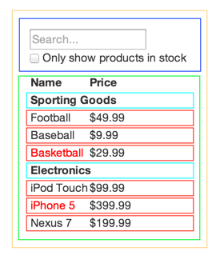

!SLIDE subsection

# React

!SLIDE fullscreen center

 

!SLIDE subsection
# What is React?

!SLIDE fullscreen

A Javascript library for building UI's

!SLIDE bullets
# React is:

* Just the UI (the V in MVC)
* Virtual DOM: Performant, simple rendering
* Encapsulated components

!SLIDE fullscreen center
# React History

 

!SLIDE bullets
# React History

* Developed at Facebook
* Extracted for use in Instagram
* In production for ~3 years

!SLIDE subsection
# Part 1: React is the Future

!SLIDE subsection
# A React Testimonial

!SLIDE bullets
# Testimonial: FB Notifications

* Notification icon in FB produced lots of bugs
* Many developers interacted with it
* Confusing, lots of regressions: State!

!SLIDE bullets
# Testimonial: FB Notifications

* Ported to React component
* New engineers understand it, immediately
* No more UI regressions

!SLIDE bullets
# UIs are Hard: Because State

* Many events trigger change
* Each event potentially modifies DOM
* Easy to break someone else's DOM
* Good luck testing combinations

!SLIDE bullets
# Request/Response is Easy: No State

* Something changed? The server regenerates everything
* Start from data and spit out HTML
* Easy to test

!SLIDE code fullscreen

    @@@ javascript
    var HelloMessage = React.createClass({
      render: function() {
        return 
Hello {this.props.name}
;
      }
    });

    React.render(
        <HelloMessage name="John" />, mountNode
    );

!SLIDE bullets
# React `.render()` is Request/Response

* Declarative `render()`, easy to debug
* Encapsulated components instead of HTML pages
* Easy lifecycle

!SLIDE bullets
# That Sounds Slow

* DOM operations **are slow**
* React has a diff engine for efficient DOM updates
* No dirty-checking or polling

!SLIDE subsection
# React vs Angular/Ember/etc

!SLIDE subsection
# How Angular Feels

!SLIDE fullscreen center

 

!SLIDE subsection
# How React Feels

!SLIDE fullscreen center

 

!SLIDE bullets
# React vs Angular/Ember/etc

* React is just the V in MVC
* Angular considering using React in 2.0
* React doesn't need to "own" your page

!SLIDE bullets
# Other React Benefits

* Great component encapsulation. Reusability!
* React Native for iOS
* Large (and growing) community
* Used in production by Facebook (Angular isn't used by Google)

!SLIDE subsection
# Part 2: Isomorphic javascript is important

!SLIDE fullscreen center

Isomorphic JavaScript apps are JavaScript applications that can run both client-side and server-side.
 
The backend and frontend share the same code.
 
`- isomorphic.net`

!SLIDE bullets
# Bad option 1: No javascript

* With mobile networks, page reloads are bad
* Native apps train users to expect responsive UIs

!SLIDE bullets
# Bad option 2: All javascript

* The browser sucks in javascript, then makes AJAX calls, then renders things
* Angular, Ember, Meteor etc. exist to make this less sucky
* Testing is hard, SEO is hard, performance is hard
* Twitter tried and ditched this, famously

!SLIDE bullets
# Bad option 3: Hybrid

* Current reality for most of us
* Provide rich interaction where it's most important
* Still get logical "page" separation/encapsulation
* Testing the boundaries still sucks

!SLIDE bullets
# Bad option 3: Hybrid

* Choose between slow render or duped logic
* Interaction between components is brittle
* I already fixed that bug!

!SLIDE fullscreen center

 

!SLIDE bullets
# React to the rescue!

* Knows how to render `toString()`
* Send the string with the response
* Javascript registers handlers and takes it from there

!SLIDE subsection
# Part 3: Start using React today

React.js is easy to add to your **existing** project.

!SLIDE fullscreen center

 

!SLIDE bullets
# Great React Tutorials

* Start with [official tutorial](http://facebook.github.io/react/docs/tutorial.html)
* Then read [Thinking in React](http://facebook.github.io/react/docs/thinking-in-react.html)
* We can't cover React, tonight

!SLIDE subsection
# Whirlwind React

!SLIDE fullscreen center

1- Everything is a component

 

!SLIDE subsection
2- Components `render()` themselves

!SLIDE code fullscreen

    @@@ javascript
    var HelloMessage = React.createClass({
      render: function() {
        return 
Hello {this.props.name}
;
      }
    });

!SLIDE subsection
3- Components have children

!SLIDE code fullscreen

    @@@
    - CommentBox
      - CommentList
        - Comment
      - CommentForm

!SLIDE subsection
4- Components have properties

!SLIDE code fullscreen

    @@@ javascript
    var CommentList = React.createClass({
      render: function() {
        return (
          

            <Comment author="Pete">One comment</Comment>
            <Comment author="Jordan">*another* comment</Comment>
          

        );
      }
    });

!SLIDE subsection
# Now you're all React experts

(seriously, it's just javascript)

!SLIDE subsection
# Using React in Django

1. Pick something to serve data
2. Pick a build tool
3. Write your first component

!SLIDE bullets
# 1. Serve data with django-REST-framework

* Free [interactive docs](http://restframework.herokuapp.com/)
* API's for ORM and non-ORM sources
* Batteries included: authentication, throttling, permissions
* Excellent docs

!SLIDE bullets
# 2. My build requirements

* Uses the React-ubiquitous [webpack](http://webpack.github.io/)
* Supports server-side rendering
* Supports efficient production deploys

!SLIDE bullets
# 2. Use [python-react](https://github.com/markfinger/python-react) to build

* All of the control of webpack, with good defaults
* Built in ES6 compilation via [Babel](https://babeljs.io/)
* Not Django-specific

!SLIDE bullets
# Sidebar: Other build options

* [PyReact](https://github.com/reactjs/react-python) works with [django-pipeline](https://github.com/cyberdelia/django-pipeline)
* There are Browserify options
* None satisfy the other requirements

!SLIDE subsection
# 3. Write your first component

!SLIDE code fullscreen

Remember our `CommentBox` component

    @@@
    - CommentBox
      - CommentList
        - Comment
      - CommentForm

!SLIDE code fullscreen

[comment_box.jsx](https://github.com/markfinger/python-react/tree/master/example/static/jsx)

    @@@ javascript
    React.createClass({
        ...
        render() {
            return (
                

                    <CommentList comments={this.state.comments} />
                    <CommentForm
                        url={this.props.url}
                        onCommentSubmit={this.handleCommentSubmit} />
                

            );
        }
    });

!SLIDE code fullscreen

myapp/views.py

    @@@ python
    def index(request):
        comments = Comment.objects.values('author', 'text')
        comment_box = render_component(
            os.path.join(STATIC_ROOT, 'jsx', 'comment_box.jsx'),
            props={
                'comments': comments,
                'url': '/comment/',
            },
        )
        return render(
            request,
            'index.html',
            {'comment_box': comment_box},
        )

!SLIDE code fullscreen

templates/myapp/index.html

    @@@ html
    
Other content

    
{{ comment_box|safe }}

    
Maybe a footer

    {{ comment_box.render_js()|safe }}

!SLIDE subsection
# Try React

* It's the future
* You can use it today

!SLIDE fullscreen center

 

We're hiring!

[careers.stackoverflow.com/company/policystat](https://careers.stackoverflow.com/company/policystat)

!SLIDE subsection
# Appendix A: Using python-react

!SLIDE bullets
# Nodejs for the pythonista

* [nvm](https://github.com/creationix/nvm) is your virtualenv
* [npm](https://www.npmjs.com/) is your pip + pypi

!SLIDE bullets
# Installing nvm

!SLIDE code fullscreen

    @@@ shell
    $ wget -qO- https://raw.githubusercontent.com/creationix/nvm/v0.25.1/install.sh | bash
    $ source ~/.bash_profile
    $ nvm install 0.10

!SLIDE bullets
# python-react: Installation

* Uses [python-js-host](https://github.com/markfinger/python-js-host/) to provide performant rendering

!SLIDE bullets
# python-react: Installation

!SLIDE code fullscreen

    @@@ shell
    $ pip install react
    $ npm install --save react react-render
    # Add `react` to `INSTALLED_APPS`

!SLIDE bullets
# python-react: Config Files

* `host.config.js`
* `package.json`
* `settings.py`
* See the [example](https://github.com/markfinger/python-react/blob/master/example)

!SLIDE subsection
# Appendix B: PyReact Has a PR for Isomorphic Support

## PyReact With Server-Side Rendering

* [PR#27](https://github.com/reactjs/react-python/pull/27/files)
* Uses [PyExecJS](https://github.com/doloopwhile/PyExecJS), which forks a process

!SLIDE subsection
# Appendix C: Future

* Cool things on the horizon

!SLIDE bullets
# Relay + GraphQL

* Facebook is using this
* Lets components define their required data
* [Relay FAQ](https://gist.github.com/wincent/598fa75e22bdfa44cf47?)

!SLIDE bullets
# Relay + GraphQL Value Prop

* Component decides what data it needs
* Performance: Batches queries from components
* Simplified server: No public/private API fragmentation
* Free "otimistic" updates with rollback

!SLIDE bullets
# Django's role?

* Django-REST-framework GraphQL serialization

!SLIDE subsection
# Appendix D: Helpers

* [React Developer Tools](https://chrome.google.com/webstore/detail/react-developer-tools/fmkadmapgofadopljbjfkapdkoienihi?hl=en) Chrome Extension
* Moving towards single-page app? [react-router](https://github.com/rackt/react-router)
* [Wiki](https://github.com/facebook/react/wiki/Complementary-Tools) with >300 tools

!SLIDE subsection
# Appendix E: Further Reading

* [Thinking in React](http://facebook.github.io/react/docs/thinking-in-react.html)
* [react-tutorial-django](https://github.com/HorizonXP/react-tutorial-django), which uses django-pipeline
* [Taming Complexity with Django and React.js](http://lanyrd.com/2014/djangocon/sczrzw/)
* [flux](http://facebook.github.io/flux/docs/overview.html)

!SLIDE fullscreen center

 

We're hiring!

