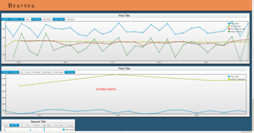
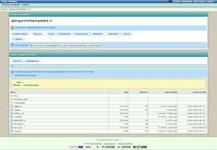
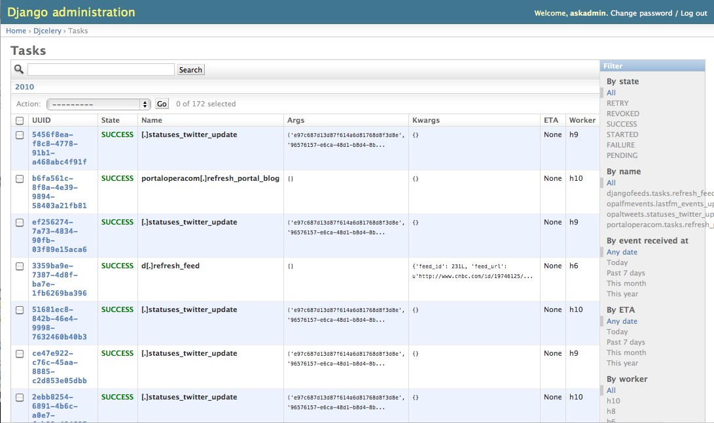

!SLIDE fullscreen

 

!SLIDE 
# udacity: build a search engine #

* Startup trying to change education
* Free CS 101 course in python
* [http://www.udacity.com/overview/Course/cs101/](http://www.udacity.com/overview/Course/cs101/)

!SLIDE fullscreen

 

!SLIDE 
# Blog: 15 resources to learn Django #

* Visualize your metrics with python
* Uses mogodb, numpy and web2py
* [http://tech.yipit.com/2012/02/28/learn-django/](http://tech.yipit.com/2012/02/28/learn-django/)

!SLIDE fullscreen

 

!SLIDE 
# Bravura: Time-series visualization #

* Visualize your metrics with python
* Uses mongodb, numpy and web2py
* [https://github.com/spicavigo/bravura](https://github.com/spicavigo/bravura)

!SLIDE fullscreen
 

!SLIDE fullscreen

 

!SLIDE 
# Django 1.4 beta 1 #

* Released February 15
* 1.4 due in March
* Good stuff

!SLIDE 
# Django 1.4 beta 1 #

* prefetch_related
* html5
* template exeptions not wrapped
* time zones!

!SLIDE fullscreen

 

!SLIDE 
# Celery 2.5 released #

* Timezone support
* Solution for hanging workers
* ~3x reduction in task-running overhead
