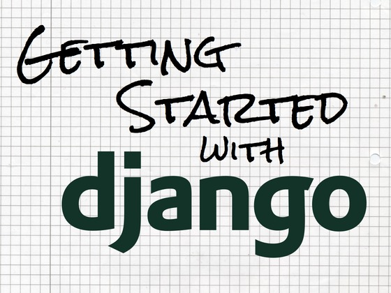
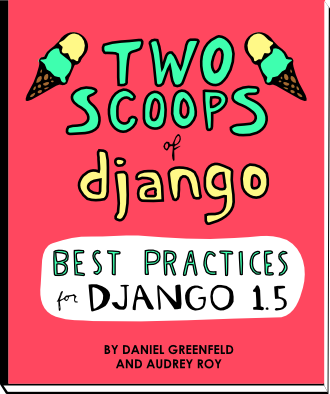

!SLIDE
# Google+ page for news #

* Circle IndyDjango
* Share items with IndyDjango for news inclusion
* Other ideas?

!SLIDE fullscreen

 

!SLIDE
# Django 1.5 release candidate #

* January 4
* Experimental python 3
* Better intermediate model caching
* Faster fixture loading

!SLIDE fullscreen

 

!SLIDE
# Getting Started With DJango #

* Awesome video/text tutorials
* Beyond tutorial
* Use current hotness: Vagrant, Heroku
* Kickstarted project

!SLIDE fullscreen

 

!SLIDE
# Two Scoops of django #

* New book on best practices
* Written by Daniel Greenfeld and Audrey Roy
* Folks behind Django Packages
