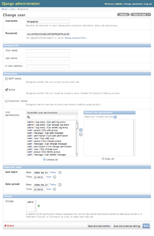

!SLIDE
# Google+ page for news #

* Circle IndyDjango
* Share items with IndyDjango for news inclusion
* Other ideas?

!SLIDE fullscreen

 

!SLIDE
# We're at the Speak Easy

* There's beer
* More central location
* Give feedback!

!SLIDE fullscreen

 

!SLIDE
# New DSF Members

* Django Software Foundation
* 5 core commiters now DSF
* 3 others added

!SLIDE fullscreen

 

!SLIDE
# Blog: MVC Is not a Helpful Django Analogy

* Written by [Luke Plant](http://lukeplant.me.uk/blog/posts/mvc-is-not-a-helpful-analogy-for-django/)
* MVC is about stateful GUI apps
* HTTP is stateless, think HTTP
* Separation of display and data is not MVC

!SLIDE fullscreen

 

!SLIDE
# Core Schema Migrations Progressing

* [Kickstarter Funded](http://www.kickstarter.com/projects/andrewgodwin/schema-migrations-for-django)
* [Andrew Godwin](http://www.aeracode.org/2013/6/20/tunnel-lights/) is making it happen
* Cool new features: Migrations by default, autodetection++

!SLIDE fullscreen

 

!SLIDE
# Blog: Writing pluggable apps

* Written by [Caktus Group](http://www.caktusgroup.com/blog/2013/06/12/making-your-django-app-more-pluggable/)
* Checklist of features
* Generic FKs
* Settings with reasonable defaults

