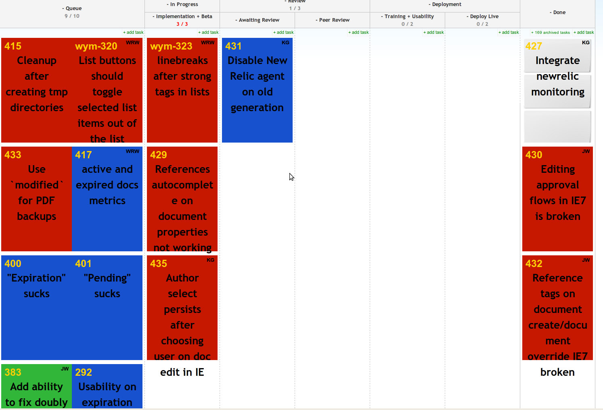

!SLIDE 
# Kanban #

* KAHN - BON

!SLIDE fullscreen

 

!SLIDE bullets incremental
# History #

* Toyota Production System 1970's
* Continual process improvement
* Manufacturing roots
* Supply-chain management via "pull"

!SLIDE
# Is it Awesome? #

* Yes

!SLIDE bullets incremental
# But for who? #

* Everyone that pushes tasks through a process
* Software
* Manufacturing
* Client Services

!SLIDE
# Benefits #

* Identify process bottlenecks
* Visibility! (What are you working on?)
* Identify process bottlenecks
* Moving cards feels good

!SLIDE fullscreen

 

!SLIDE bullets incremental
# Kanban Board #

* Physical board
* Cards == Tasks
* Columns == Process Steps

!SLIDE bullets incremental
# Key Points #

* HUD of all current activity (need buy-in)
* Limit Work in Progress (WIP)
* Start with current process
* Physical is best to start

!SLIDE bullets incremental
# Getting Started #

* Buy 3x5s or sticky notes
* Map your (actual) process on a whiteboard/window
* Start with a high WIP
* Commit for a time period

!SLIDE bullets incremental
# Pitfalls #

* Half-usage is no usage
* Out of sight, out of mind. Devs are lazy
* Ocean boiling: Smallest process improvement possible

