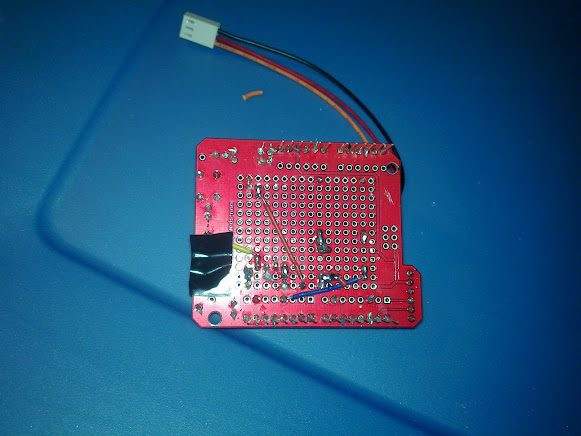

!SLIDE bullets incremental
# this is a thing!? #

* what's better than beer?
* beer + arduino
* all open source

!SLIDE 
# getting meta #

* not detailed how-to: docs are better
* my goal: motivate!
* some tips

!SLIDE fullscreen

 
 
!SLIDE fullscreen

 

!SLIDE bullets incremental
# why a kegbot? #

* how much beer is left?
* who drank how much?
* pretty graphs
* ...more?

!SLIDE fullscreen

 

!SLIDE
# is it Awesome? #

* Yes

!SLIDE bullets incremental
# impractical things #

* entrance music?
* tweet insults for bad pours
* BAC calculations
* collect payment

!SLIDE bullets incremental
# why would I ever need to... #

* shutup. it's awesome
* great learner project

!SLIDE bullets incremental
# kegbot architecture #

* arduino firmware
* open schematics
* python daemon
* python + Django web frontend

!SLIDE bullets incremental
# parts: ~$100 #

* flowmeter 
* arduino + kegbot shield
* rfid reader
* misc (jumpers, molex, breadboard, buzzers)

!SLIDE
# rigging encouraged #

* ugly works

!SLIDE fullscreen

 

!SLIDE fullscreen

 

!SLIDE
# hiding the ugly #

* lots of good arduino enclosures

!SLIDE fullscreen

 

!SLIDE bullets incremental
# protips #

* SF800 flowmeter- Dutch
* plumbing is a pain- 3/16 inch
* protect your flowmeter

!SLIDE bullets incremental
# future improvements #

* use a Rasberry Pi
* one-command kegweb setup?
* kegbot in the cloud?
* android tablet version

