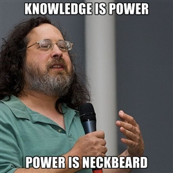
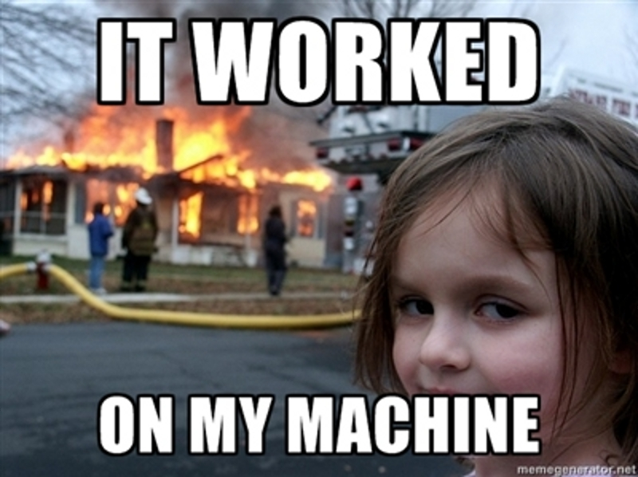

!SLIDE bullets
# Good production deploys are hard

* Should be *one* command run by a *developer*
* Should be *fast* and embrace cloud ephemerality
* Shouldn't let you break things
* Shouldn't interrupt customers

!SLIDE fullscreen

 

        photo: <a href="http://memegenerator.net/Richard-Stallman/images/new/alltime/page/2">
memegenerator.net</a>

!SLIDE bullets incremental
# Bad production deploys are easy

* Oops. Pypi was down. Users get 500s
* Oops. An EC2 instance poofed. Users get 500s
* Oops. I forgot a step on the wiki. Users get 500s
* Oops. Rotated out the only working node. Users get 500s

!SLIDE fullscreen

 

        photo: <a href="http://memegenerator.net/instance/36234685">
memegenerator.net</a>

!SLIDE bullets
# Folks who don't care

* (quality) Large companies with devops teams

!SLIDE fullscreen

 

        photo: <a href="http://www.theverge.com/2013/2/13/3986794/vince-vaughn-and-owen-wilson-go-to-google-in-the-trailer-for-the-internship">
www.theverge.com</a>

!SLIDE bullets
# Folks who don't care

* Google, LinkedIn, Facebook, Amazon.com, Netflix, etc
* Already solved this
* Deployinator, Borg, Asgard, Mesos, Sekrits

!SLIDE bullets
# Folks who don't care

* Deploying known-working 3rd-party apps (Wordpress)
* Hobby projects
* Deploy once per month to your one co-lo server
* On a PaaS and very happy

!SLIDE bullets
# You should care

* You want to practice continuous delivery
* Your customers care about your thing
* Your deploy takes more than *one* manual step

!SLIDE bullets
# You should care

* You want to take advantage of dynamic scaling
* You are scared of deployment
* Your disaster recovery is different than your deploy

!SLIDE bullets
# Tools solving similar problems

* Orchestration
* "Pull-based" Configuration Management

!SLIDE fullscreen

 

        photo: <a href="http://fingercandymedia.com/5104-square-peg-in-a-round-hole-social-media">
fingercandymedia.com</a>

!SLIDE bullets
# Orchestration (PaaS-ish)

* Juju, Stackato, Cloud Foundry, Open Shift etc etc
* Partial deploys?
* Manage EC2 nodes?
* Detect that I'm breaking things?
* Own my backing services?

!SLIDE bullets
# "Pull-based" Configuration Management

* Chef Server, Puppet, Salt Stack
* Who launches and terminates my nodes?
* Partial deploys?
* Slow rollouts, maintaining redundancy?
* RDS? External backing services?

!SLIDE bullets
# Re-inventing Wheels

* We're all writing the same "glue" code!

!SLIDE fullscreen

 

        photo: <a href="http://www.blueinkalchemy.com/2010/10/18/reinventing-the-wheel/">
www.blueinkalchemy.com</a>

!SLIDE bullets
# You've probably already done this!

* There exist awesome FOSS tools for parts of the problem
* Fabric + Chef + Boto + Bash + ...
* Congrats, you're now a one-person Heroku
* Good luck competing on developer happiness

!SLIDE fullscreen

 

        photo: <a href="http://bygeeksforgeeks.blogspot.com/2012/10/flashback-friday-captain-planet-and_13.html">
bygeeksforgeeks.blogspot.com</a>

!SLIDE bullets
# With our powers combined

* Piggyback on existing projects
* Tie them together
* Agree on strong interfaces for extensibility

!SLIDE bullets
# Help Me

* [Neckbeard](https://github.com/winhamwr/neckbeard)
* Open-sourcing what I have
* Strongly Heroku-convergent interface
* Fabric + Boto + SimpleDB + LittleChef + Chef-solo

!SLIDE bullets
# The Future

* `$ neckbeard up`
* Find existing nodes/services and launch/configure new ones (with data)
* Understand AZ's, rotate nodes out of the load balancer, deploy to them
* If they're not healthy, stop! Needs human intervention
* Hooks for monitoring, logging, reporting, etc
