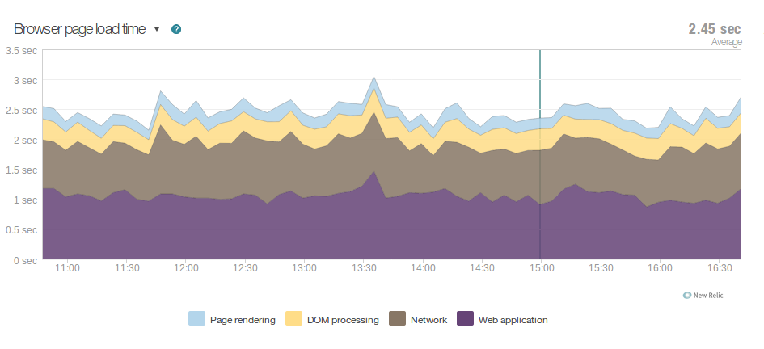
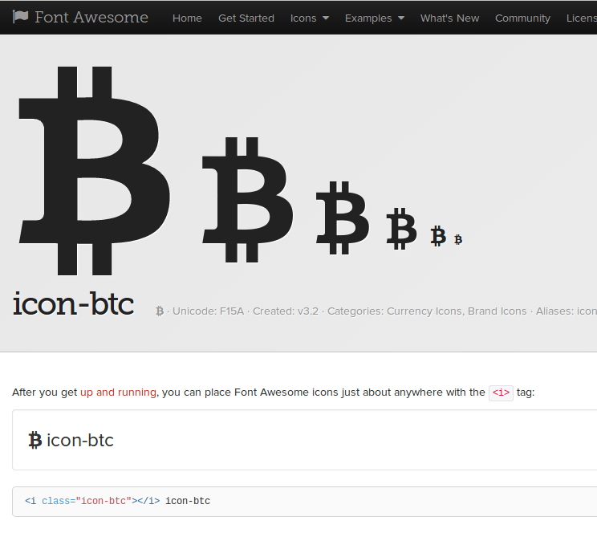
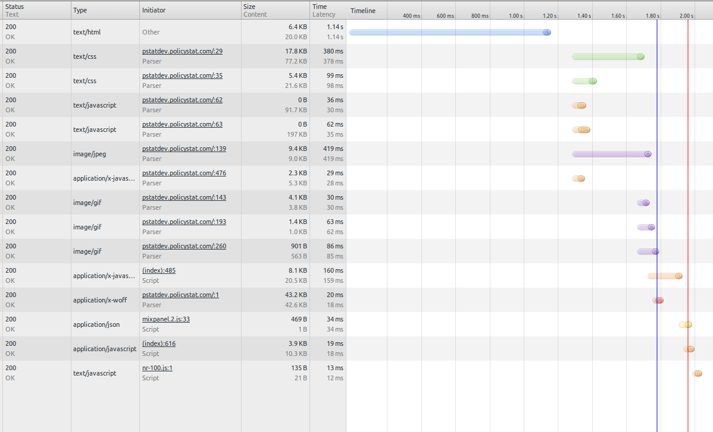

!SLIDE subsection

# Performance Matters

!SLIDE fullscreen center

 

        photo: <a href="http://www.cloudreviews.com/blog/web-performance-optimization-part-1">
cloudreviews.com</a>

!SLIDE
# The magic number now is now somewhere between 300 to 250ms

### - Harry Schum, Speed specialist for MS

!SLIDE bullets
# Study Results

* Bing- 2s == 4.3% less revenue
* Yahoo- 400ms == 5-9% less traffic
* Google- 400ms == ~1% less searching

!SLIDE subsection

# But we're busy!

!SLIDE bullets
# Not that busy

* Many cheap/easy "optimizations"
* Easy once you notice them
* One-time improvements with big payoffs

!SLIDE subsection

# First rule of optimization:

!SLIDE subsection

# No premature optimization

!SLIDE subsection

# It affects to lots of developers

!SLIDE fullscreen center

 

!SLIDE bullets
# Choose obvious wins!

* Don't add code complexity
* Don't make things fragile
* But you should be monitoring (New Relic)

!SLIDE subsection

# Advice by (bad) example

!SLIDE subsection

# Anti-pattern 1: Ignore the front end

!SLIDE fullscreen center

 

!SLIDE bullets
# Our easiest wins are on the front end!

* Server side `<50%` of time
* Usually `<25%`

!SLIDE bullets
# Front end 20%: Reverse Proxy

* Lives in front of `uwsgi`/`mod_wsgi`
* Protects you from slow clients
* Serves your media crazy-fast

!SLIDE bullets
# Front end 20%: GZIP

* Tell nginx to GZIP everything
* Remove django gzip middleware
* Cut network transfer in half, for free

!SLIDE fullscreen center

 

!SLIDE bullets
# Front end 20%: Use a font icon

* HTTP requests for single icons slow you down
* FontAwesome etc look better, anyway

!SLIDE bullets
# Front end 20%: Merged media

* Use django-compressor (etc)
* CSS at the top, JS at the bottom
* Fewer HTTP requests win!

!SLIDE code fullscreen

    @@@ html
    <!-- my_template.html -->

    

    
    <link rel="stylesheet"
        href="/static/css/one.css" type="text/css">
    <link rel="stylesheet"
        href="/static/css/two.css" type="text/css">
    

!SLIDE fullscreen center

 

!SLIDE subsection

# Anti-pattern 2: Database black box

!SLIDE bullets
# Ways to kill your database

* Don't use a cache or read slave
* What's an index?
* Who needs SQL?

!SLIDE bullets
# Database 20%: Slow Query Log

* Tells you when you're bad
* Can still mostly use the ORM

!SLIDE subsection

# Enable the Slow Query Log

!SLIDE code

    @@@ Makefile
    # /etc/mysql/conf.d/slow_query.cnf

    slow_query_log = 1
    long_query_time = .1
    log_queries_not_using_indexes = 1

!SLIDE subsection

# Read the Slow Query Log

!SLIDE code

    @@@ SQL
    # Time: 130823 13:45:48
    # User@Host: live0[live0] @ URL[IP]
    # Query_time: 10.454075  Lock_time: 0.000085
    # Rows_sent: 20  Rows_examined: 149654
    use policystat;
    SET timestamp=1377265548;

!SLIDE code

# How bad was it?

    @@@ SQL
    # Query_time: 10.454075  Lock_time: 0.000085
    # Rows_sent: 20  Rows_examined: 149654

!SLIDE code

# When was it?

    @@@ SQL
    SET timestamp=1377265548;

!SLIDE code

    @@@ SQL
    SELECT `auth_user`.`id`, ...snip...
    FROM `auth_user` LEFT OUTER JOIN `pstat_profile`
      ON (`auth_user`.`id` = `pstat_profile`.`user_id`)
      INNER JOIN `pstat_tenant`
        ON (`pstat_profile`.`tenant_id` = `pstat_tenant`.`id`)

!SLIDE code

    @@@ SQL
    WHERE (`pstat_profile`.`is_guest` = 0
      AND `pstat_profile`.`tenant_id` IN (
        301, ...snip... 356)
      AND `auth_user`.`is_superuser` = 0
      AND `auth_user`.`is_active` = 1
    )

!SLIDE bullets

# Where clause across tables

* Can't index across tables with MySQL
* Your DB chooses *one* index per table
* A JOIN key counts as *one*
* Easy to filter superuser and inactive in app code

!SLIDE code

    @@@ SQL
    ORDER BY `auth_user`.`last_name` ASC,
    `auth_user`.`first_name` ASC,
    `auth_user`.`username` ASC
    LIMIT 20;

!SLIDE bullets

# Complex `ORDER BY`

* No index there
* Creates a temporary table!
* Beware of default `order_by`

!SLIDE bullets
# Database fixes

* Add an index `tenant_id, is_guest`
* Python-side filtering `is_superuser, is_active`
* Sort on indexes `last_name, first_name, username`

!SLIDE subsection

# Anti-pattern 3: Default Web Framework Settings

!SLIDE bullets
# Django Settings 20%: Cache Templates

* Template evaluation is fast
* Disk I/O can be slow
* Cache templates in memory!

!SLIDE code

    @@@ python
    # settings.py

    TEMPLATE_LOADERS = (
    (
      'django.template.loaders.cached.Loader',
      (
        'django.template.loaders.filesystem.Loader',
        'django.template.loaders.app_directories.Loader',
      )
    ),
    )

!SLIDE subsection

# Anti-pattern 4: Query all the things!

!SLIDE bullets
# Query 20%: Batch queries

* Don't do queries when iterating in templates
* Get things in one big query, where possible
* `select_related()` is usually your friend

!SLIDE code

    @@@ python
    # views.py
    context = {
        'my_things': MyThing.objects.filter(foo=bar)
    }
<!-- separator -->

    @@@ html
    <!-- my_template.html -->
    <table>
    
        <tr>
            <td>{{ my_thing.name }}</td>
            <td>{{ my_thing.other_thing.name }}</td>
        <tr>
    
    </table>

!SLIDE subsection

# See the fail?

!SLIDE code

`select_related()` to the rescue!

    @@@ python
    # views.py

    context = {
        'my_things': MyThing.objects.filter(
            foo=bar
        ).select_related('other_thing__name')
    }

!SLIDE subsection

# Automate catching this fail!

!SLIDE code

    @@@ python
    # views.py

    def test_query_growth(self):
        expected_queries = FuzzyInteger(10, 13)

        # Make 5 MyThing objects

        with self.assertNumQueries(expected_queries):
            # Load the view

        # Make 5 more MyThing objects

        with self.assertNumQueries(expected_queries):
            # Load the view again

!SLIDE bullets
# Focus on the easy wins

* No extra complexity
* Make them a habit
* The other 20% is much harder
